# Snake & Space Invaders — STM32F103 Embedded Game Console

> **Project 2 (P2) — UNSTPB ETTI Politehnica București, 2024**
> A fully embedded, from-scratch implementation of the classic Snake game (and Space Invaders) running on an STM32F103CBTx microcontroller with a 128×128 TFT LCD display.
> Author: Miron Andrei-Auras.

---

## 📋 Table of Contents

- [Introduction](#introduction)
- [Hardware Components](#hardware-components)
- [Hardware Configuration & Pinout](#hardware-configuration--pinout)
- [Communication Protocol — SPI Half-Duplex](#communication-protocol--spi-half-duplex)
- [Interrupts & Timer](#interrupts--timer)
- [Software Architecture & Game Logic](#software-architecture--game-logic)
  - [Game Logic Flowchart](#game-logic-flowchart)
  - [Screen Grid & Coordinate System](#screen-grid--coordinate-system)
  - [Data Structures](#data-structures)
  - [Global Variables](#global-variables)
  - [Core Functions](#core-functions)
- [Game Features](#game-features)
- [Project Structure](#project-structure)
- [Build & Flash](#build--flash)

---

## Introduction

This project was developed **from scratch** as part of the **Project 2 (P2)** course at the **Faculty of Electronics, Telecommunications and Information Technology (ETTI)**, **University Politehnica of Bucharest (UNSTPB)**, during the 2024 academic year.

The goal was to implement a fully functional, real-time embedded game console on a bare-metal STM32 microcontroller, without relying on any operating system or high-level game engine. Everything — from display drivers and SPI communication to game physics, collision detection, and input handling — was written by hand in C.

The console supports two games selectable from a startup menu:
- **Snake** — the classic game where the player steers a growing snake around the screen, eating food and avoiding self-collision.
- **Space Invaders** — a shoot-'em-up arcade game (implemented in a separate module, `SpaceInv.c`).

The entire project runs on an **STM32F103CBTx** microcontroller (ARM Cortex-M3), driving a **1.44" ST7735 128×128 TFT LCD** over SPI, with four directional push-buttons connected as external interrupts.

---

## Hardware Components

| Component | Description |
|-----------|-------------|
| **MCU** | STM32F103CBTx — ARM Cortex-M3, 72 MHz, LQFP48 |
| **Display** | 1.44" TFT LCD, ST7735 driver, 128×128 pixels, 16-bit color (RGB565) |
| **Buttons** | 4× tactile push-buttons (Up, Down, Left, Right) |
| **PCB** | Custom development board — ETTI 2024, P2-STM rev 1.1 |
| **Crystal** | 8 MHz external HSE oscillator (PLL configured for 72 MHz SYSCLK) |
| **USB** | Full-speed USB peripheral (onboard, used for power/programming) |
| **UART** | USART1 at 9600 baud (used for debug coordinate output) |
| **Prototyping** | All components hand-soldered onto the PCB and a perfboard adapter |

### Physical Build

All wiring between the LCD module and the MCU board was soldered by hand onto a perfboard, with jumper wires connecting each signal line. The LCD module is mounted directly onto the custom PCB via a dedicated header.

**Perfboard wiring (back):**

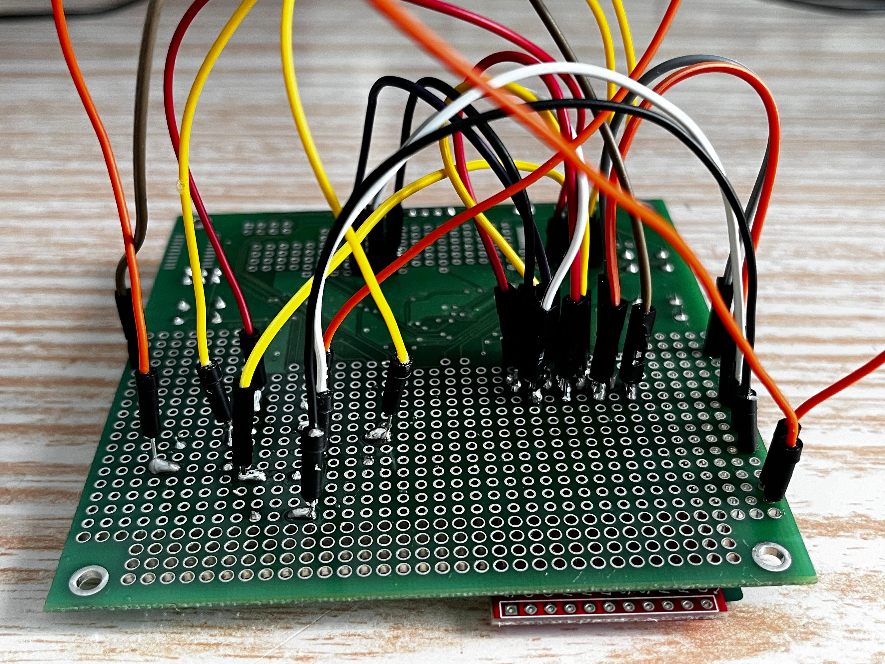

**Final assembled board — top view:**

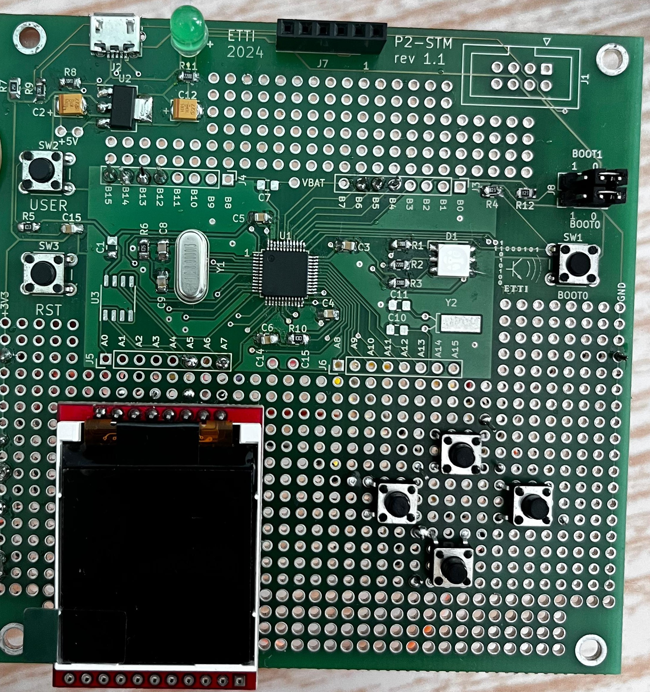

---

## Hardware Configuration & Pinout

The MCU pinout was configured using STM32CubeMX and is reflected in the firmware initialization code.

**MCU — STM32F103CBTx LQFP48 pinout:**

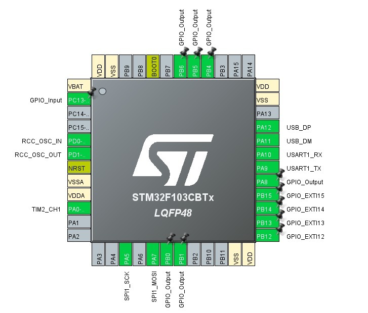

**LCD driver pin definitions in software (`st7735.h`):**

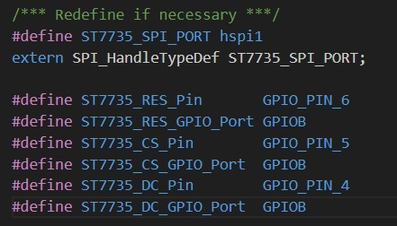

### Pin Mapping Summary

| Signal | MCU Pin | GPIO |
|--------|---------|------|
| SPI1 SCK | PA5 | GPIOA |
| SPI1 MOSI | PA7 | GPIOA |
| LCD Reset (RES) | PB6 | GPIOB |
| LCD Chip Select (CS) | PB5 | GPIOB |
| LCD Data/Command (DC) | PB4 | GPIOB |
| LCD Backlight / PA8 | PA8 | GPIOA |
| Button UP | PB12 | GPIOB — EXTI12 |
| Button DOWN | PB13 | GPIOB — EXTI13 |
| Button RIGHT | PB14 | GPIOB — EXTI14 |
| Button LEFT | PB15 | GPIOB — EXTI15 |
| User Button (confirm) | PC13 | GPIOC — Input Pull-Up |

---

## Communication Protocol — SPI Half-Duplex

The ST7735 LCD is driven via **SPI1 in 1-line (half-duplex) mode**, meaning only MOSI is used (no MISO line needed for a write-only display). The SPI is configured as master, 8-bit data, CPOL=Low, CPHA=1Edge, MSB first, with a baud rate prescaler of 32 (resulting in approximately 2.25 MHz SCK from the 72 MHz APB2 clock).

The `DC` (Data/Command) pin is toggled manually in the driver to distinguish between command bytes and pixel data bytes, as required by the ST7735 protocol.

```c
hspi1.Instance = SPI1;
hspi1.Init.Mode = SPI_MODE_MASTER;
hspi1.Init.Direction = SPI_DIRECTION_1LINE;
hspi1.Init.DataSize = SPI_DATASIZE_8BIT;
hspi1.Init.CLKPolarity = SPI_POLARITY_LOW;
hspi1.Init.CLKPhase = SPI_PHASE_1EDGE;
hspi1.Init.BaudRatePrescaler = SPI_BAUDRATEPRESCALER_32;
hspi1.Init.FirstBit = SPI_FIRSTBIT_MSB;
```

---

## Interrupts & Timer

### External Interrupts — Directional Buttons

All four directional buttons are configured on **GPIOB pins 12–15** as **rising-edge triggered external interrupts** (`GPIO_MODE_IT_RISING`) with internal pull-down resistors. They all share the same NVIC line (`EXTI15_10_IRQn`) at priority 0.

The interrupt callback `HAL_GPIO_EXTI_Callback()` handles direction changes with a built-in debounce guard: a direction change is only accepted if a minimum time (`timp >= 15`, i.e., ~150 ms) has elapsed since the last accepted input, preventing accidental double-presses.

Additionally, the callback enforces **180° turn prevention** — the snake cannot immediately reverse direction (e.g., going right cannot directly switch to going left):

```c
void HAL_GPIO_EXTI_Callback(uint16_t GPIO_Pin)
{
    if(timp >= 15) // Debounce: ~150ms minimum between direction changes
    {
        intrerupere = 1;

        if(GPIO_Pin == GPIO_PIN_12 && apasat13 == 0) // UP — only if not currently going DOWN
        {
            apasat12=1; apasat13=0; apasat14=0; apasat15=0;
        }
        if(GPIO_Pin == GPIO_PIN_13 && apasat12 == 0) // DOWN — only if not currently going UP
        {
            apasat12=0; apasat13=1; apasat14=0; apasat15=0;
        }
        if(GPIO_Pin == GPIO_PIN_14 && apasat15 == 0) // RIGHT — only if not currently going LEFT
        {
            apasat12=0; apasat13=0; apasat14=1; apasat15=0;
        }
        if(GPIO_Pin == GPIO_PIN_15 && apasat14 == 0) // LEFT — only if not currently going RIGHT
        {
            apasat12=0; apasat13=0; apasat14=0; apasat15=1;
        }

        timp = 0; // Reset debounce timer
    }
}
```

### TIM2 — Game Tick Timer

**TIM2** is configured as a periodic interrupt timer that fires **100 times per second** (every 10 ms). It increments the global `timp` counter, which is used both for debouncing button inputs and for general game timing.

```c
// TIM2: Prescaler=7199, Period=100 → fires at 72MHz/(7200*101) ≈ 100 Hz
htim2.Init.Prescaler = 7199;
htim2.Init.Period = 100;

void HAL_TIM_PeriodElapsedCallback(TIM_HandleTypeDef *htim2)
{
    timp++; // Incremented 100 times/second
}
```

This means:
- `timp >= 15` → ~150 ms debounce delay
- `timp >= 50` → ~500 ms elapsed
- `timp >= 100` → ~1 second elapsed

---

## Software Architecture & Game Logic

### Game Logic Flowchart

The following flowchart (designed during development) describes the complete game logic for Snake, from startup to game over:

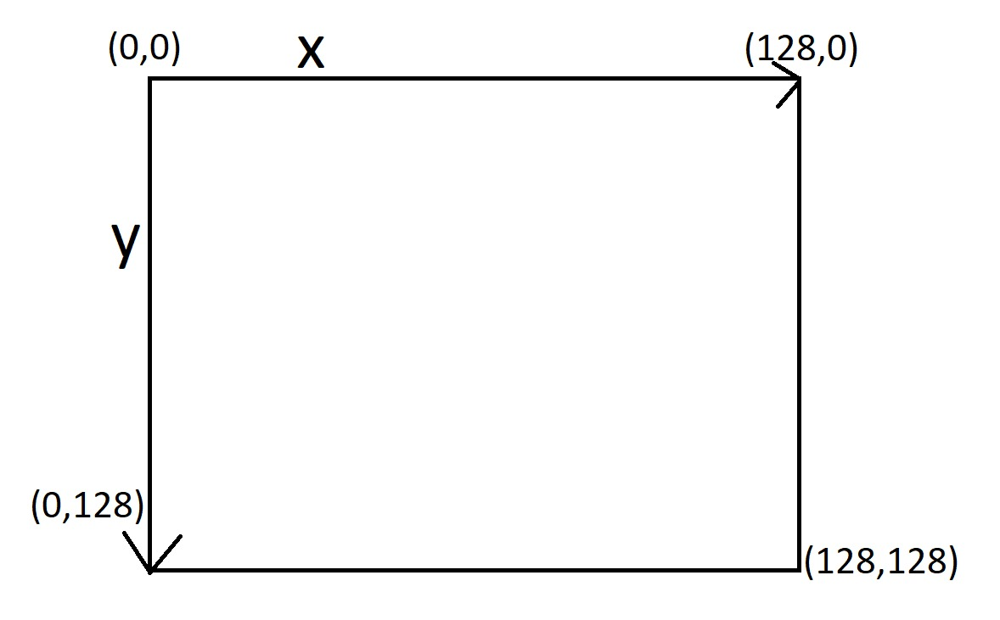

The flowchart covers:
- **Initialization**: spawn snake and food at startup
- **Input reading**: check if a button was pressed
- **Direction validation**: prevent 180° reversal (e.g., ↑ cannot go directly to ↓)
- **Movement**: continuous movement in the current direction if no new valid input
- **Food check**: if the snake's head overlaps with the food position → `corp+1` (grow body), spawn new food
- **Game over check**: detect self-collision; if game over → reset → restart from START

---

### Screen Grid & Coordinate System

The ST7735 display uses a **128×128 pixel coordinate system** with the origin `(0,0)` at the **top-left corner**, X increasing to the right, and Y increasing downward.

**Coordinate system diagram:**

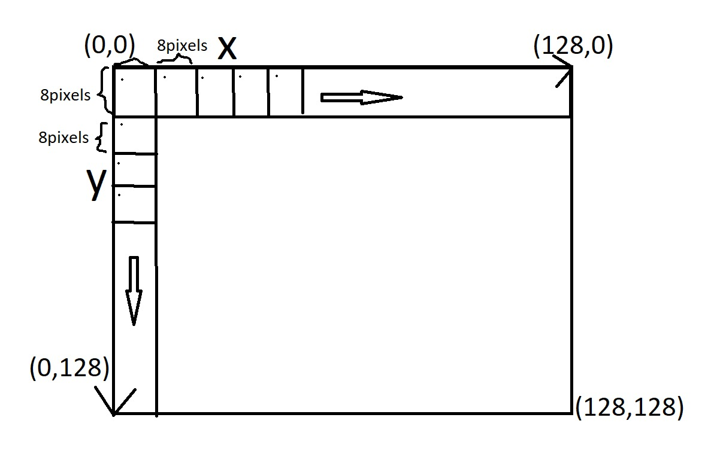

To simplify game logic and rendering, the entire screen is divided into a **grid of 8×8 pixel cells**. Every game entity (snake body segment, food) occupies exactly one cell, and all positions are aligned to multiples of 8 pixels.

**Grid structure:**

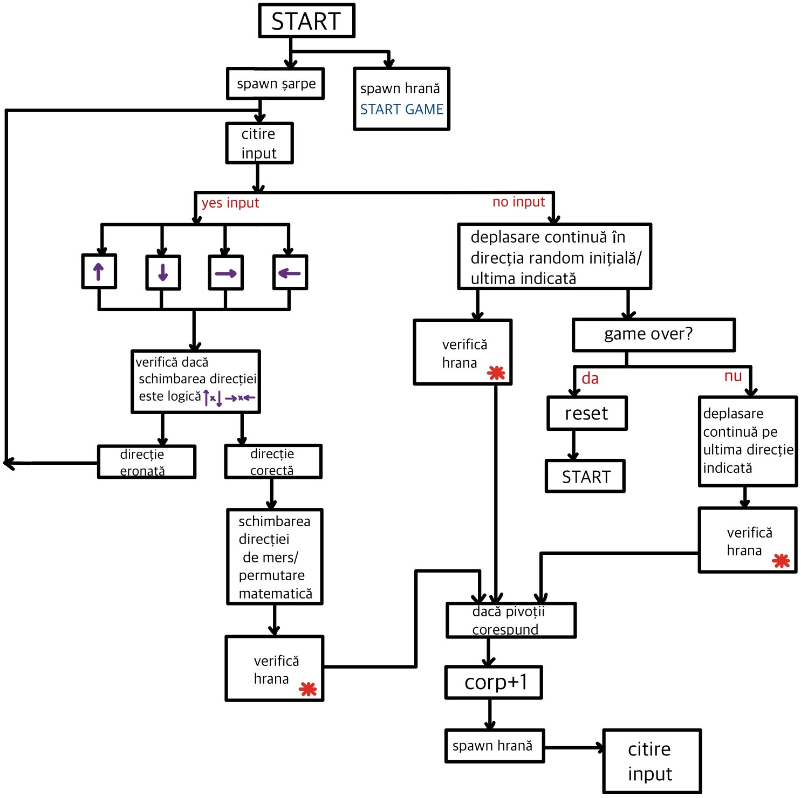

This gives a logical game grid of **16×16 cells** (128 / 8 = 16 per axis), yielding 256 possible positions for any game entity.

The **reference pixel** (pivot) for every entity is always its **top-left corner pixel** — i.e., for a cell at logical position `(col, row)`, the top-left pixel coordinates are `(col * 8, row * 8)`. All rendering functions receive and use these top-left `(x, y)` pixel coordinates.

---

### Data Structures

#### Snake Segment — `Sarpe`

The snake is represented as an **array of `Sarpe` structs**, where each element stores the pixel coordinates of one 8×8 body segment:

```c
typedef struct
{
    int16_t x;  // Top-left pixel X coordinate of the segment
    int16_t y;  // Top-left pixel Y coordinate of the segment
} Sarpe;

Sarpe sarpe[255]; // Maximum snake length: 255 segments
```

- `sarpe[0]` is always the **head** of the snake.
- `sarpe[1]` through `sarpe[scor]` are the body segments, from neck to tail.
- The array is sized to 255, matching the maximum `uint8_t` score value.

#### Key Global Variables

| Variable | Type | Description |
|----------|------|-------------|
| `sarpe[255]` | `Sarpe[]` | Array of snake body segments; index 0 = head |
| `scor` | `uint8_t` | Current snake length minus 1 (starts at 2, i.e., 3 segments) |
| `randx`, `randy` | `uint8_t` | Current food pixel coordinates (top-left of food cell) |
| `game_over` | `uint8_t` | Flag: 1 if game over, 0 if running |
| `ok1` | `uint8_t` | One-time initialization flag for first game tick |
| `temphr` | `uint8_t` | Food spawn initialization flag |
| `timp` | `uint16_t` | Timer tick counter (incremented by TIM2 at 100 Hz) |
| `intrerupere` | `uint8_t` | Flag set by EXTI callback when a button is pressed |
| `apasat12..15` | `uint8_t` | Direction flags: 12=UP, 13=DOWN, 14=RIGHT, 15=LEFT |
| `speed` | `uint16_t` | Main loop delay in ms (500=slow, 250=fast) |
| `optiuneJoc` | `bool` | Selected game: 0=Snake, 1=Space Invaders |

---

### Core Functions

#### `main()` — Entry Point & Game Loop

Initializes all peripherals (SPI, GPIO, TIM2, UART, USB), starts the TIM2 interrupt, initializes the LCD, and calls the game selection menu. Depending on the selected game:

- **Snake**: calls `interfata_initiala()` for speed selection, places the initial 3-segment snake at screen center, then enters the main loop calling `fizica_sarpe()` at the selected `speed` interval.
- **Space Invaders**: calls `motor_joc()` every 500 ms.

```c
while (1)
{
    if(optiuneJoc == 0) // Snake
    {
        if(game_over == 0)
        {
            srand(HAL_GetTick());
            fizica_sarpe();
            verifica_coliziune();
        }
        HAL_Delay(speed);
    }
    if(optiuneJoc == 1) // Space Invaders
    {
        motor_joc();
        HAL_Delay(500);
    }
}
```

---

#### `alege_joc_interfata()` — Game Selection Menu

Displays a selection screen showing "Snake" and "Space Invaders". The user navigates with PB12 (highlight Snake, shown in red) or PB13 (highlight Space Invaders, shown in blue). Pressing PC13 confirms the selection and sets `optiuneJoc`.

---

#### `interfata_initiala()` — Speed Selection Menu

Displays a red-background screen prompting the user to select game speed: "Mica" (slow, 500 ms/tick) or "Mare" (fast, 250 ms/tick), controlled by PB15 (left = slow) and PB14 (right = fast). Confirmed by PC13.

---

#### `fizica_sarpe()` — Main Snake Physics Tick

This is the heart of the snake game, called once per game tick:

1. **Checks collision** (`verifica_coliziune()`) at the start of each tick.
2. **First-tick initialization** (`ok1 == 0`): spawns the initial food, sets the default direction to RIGHT.
3. **Erases** the current snake from the screen (`update_sarpe()`).
4. **Moves** the snake in the active direction (one of `deplasare_dreapta/stanga/sus/jos()`).
5. **Redraws** the snake (`deseneaza_sarpe()`).
6. **Checks if food was eaten**: if `sarpe[0]` overlaps `(randx, randy)`, increments `scor`, appends a new body segment at the tail, redraws, and spawns new food.

---

#### Movement Functions — `deplasare_dreapta/stanga/sus/jos()`

All four movement functions follow the same pattern — this is the core of the snake's "follow the leader" locomotion:

```c
void deplasare_dreapta()
{
    // Shift every body segment to the position of the segment ahead of it
    for(uint8_t i = scor; i > 0; i--)
    {
        sarpe[i].x = sarpe[i-1].x;
        sarpe[i].y = sarpe[i-1].y;
    }

    // Move the head one cell to the right (with wraparound)
    if((sarpe[0].x) + 8 == 128)
        sarpe[0].x = 0;         // Wrap around through the right wall
    else
        sarpe[0].x = sarpe[0].x + 8;
}
```

The body shift is done **tail-to-neck** (from index `scor` down to `1`), so that each segment takes the previous position of the segment in front of it before the head moves. This gives the snake smooth, continuous following motion. **Wall wrap-around** is implemented in all four directions — the snake exits through one side and re-enters from the opposite side.

---

#### `deseneaza_sarpe()` — Render Snake

Iterates over all segments and draws each as an 8×8 green block using `pixel_sarpe()`. The **head (`sarpe[0]`)** receives special treatment: it has two pairs of **red "eyes"** drawn at fixed offsets within the 8×8 cell:

```c
if( (k==1+sarpe[0].x && l==1+sarpe[0].y) || (k==2+sarpe[0].x && l==1+sarpe[0].y) || // left eye
    (k==5+sarpe[0].x && l==1+sarpe[0].y) || (k==6+sarpe[0].x && l==1+sarpe[0].y) )   // right eye
{
    ST7735_DrawPixel(k, l, ST7735_RED);
}
else
{
    ST7735_DrawPixel(k, l, ST7735_GREEN);
}
```

---

#### `update_sarpe()` — Erase Snake

Before every movement step, the snake's current position is erased by drawing all occupied cells black (background color). This avoids display artifacts from the previous frame:

```c
void update_sarpe()
{
    for(i = 0; i <= scor; i++)
        for(j = sarpe[i].x; j < sarpe[i].x + 8; j++)
            for(z = sarpe[i].y; z < sarpe[i].y + 8; z++)
                ST7735_DrawPixel(j, z, ST7735_BLACK);
}
```

---

#### `verifica_coliziune()` — Self-Collision Detection

Checks whether the head (`sarpe[0]`) occupies the same position as any other body segment. If so, `game_over = 1` and `interfata_game_over()` is called:

```c
void verifica_coliziune()
{
    for(uint8_t i = 1; i <= scor; i++)
    {
        if(sarpe[0].x == sarpe[i].x && sarpe[0].y == sarpe[i].y)
        {
            game_over = 1;
            interfata_game_over();
        }
    }
}
```

> **Note:** Wall collision is intentionally disabled — the snake wraps around instead of dying at the edges.

---

#### `spawn_mancare()` — Food Spawning

Generates a random food position aligned to the 8-pixel grid, ensuring it does not overlap any current snake segment. Uses `rand()` seeded with `HAL_GetTick()` for pseudorandom behavior:

```c
randx = (rand() % 16) * 8;  // Random column: 0, 8, 16, ..., 120
randy = (rand() % 16) * 8;  // Random row:    0, 8, 16, ..., 120
```

The validity check loops through all snake segments and retries if a collision is found. Once a valid position is found, `pixel_hrana()` draws the food as an 8×8 red block.

---

#### `interfata_game_over()` — Game Over Screen

Fills the screen with red (using an animated 8×8 block fill loop for visual effect), then displays "Game over! :(" and the final score using a large font:

```c
ST7735_WriteString(0, 30, " Game over!     :( ", Font_11x18, ST7735_BLACK, ST7735_RED);
```

The score is converted from the internal `scor` variable (which starts at 2) to a 3-digit decimal string via `conversie_char()`, and displayed centered on screen.

---

#### `conversie_char()` — Integer to String Conversion

Converts the `uint8_t` score (offset by 2, since the snake starts with 3 segments) to a 3-character decimal string for display. No standard library `sprintf` is used — conversion is done manually with digit extraction:

```c
void conversie_char(char *ScorString)
{
    uint8_t temp = scor - 2;
    ScorString[0] = (temp / 100 + '0');
    ScorString[1] = ((temp / 10) % 10 + '0');
    ScorString[2] = (temp % 10 + '0');
    ScorString[3] = '\0';
}
```

---

#### `pixel_sarpe()` / `pixel_hrana()` — Primitive Drawing

Low-level 8×8 block drawing functions used by the snake and food renderers. Both take a top-left `(x, y)` pivot and draw all 64 pixels of the cell in the corresponding color (green for snake body, red for food) using `ST7735_DrawPixel()`.

---

## Game Features

| Feature | Description |
|---------|-------------|
| **Game selection menu** | Choose between Snake and Space Invaders at startup |
| **Speed selection** | Snake: slow (500 ms/tick) or fast (250 ms/tick) |
| **Snake head with eyes** | The head has red pixel eyes for visual distinction |
| **Wall wraparound** | Snake exits one edge and re-enters from the opposite side |
| **Self-collision detection** | Game over when head touches any body segment |
| **180° reversal prevention** | Cannot immediately reverse direction |
| **Button debounce** | ~150 ms hardware debounce via TIM2 counter |
| **Animated food spawning** | Food spawns at a random grid-aligned cell, never on the snake |
| **Game over screen** | Animated red fill, score displayed in large font |
| **UART debug output** | Food coordinates transmitted via USART1 at 9600 baud |

---

## Gameplay Screenshots

**Snake running — early game:**

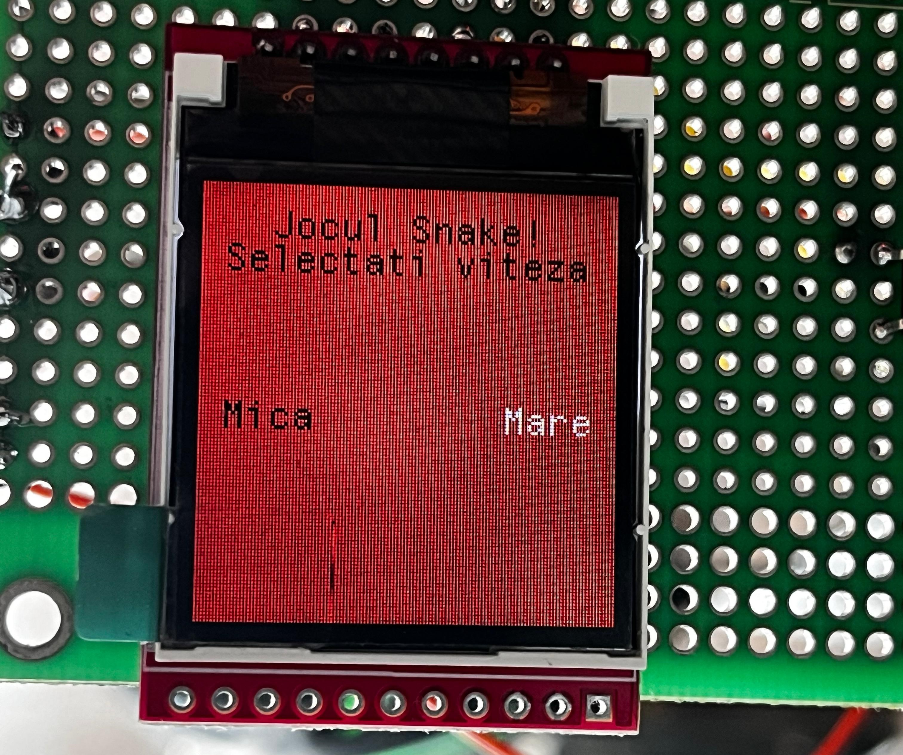

**Snake running — more segments collected:**

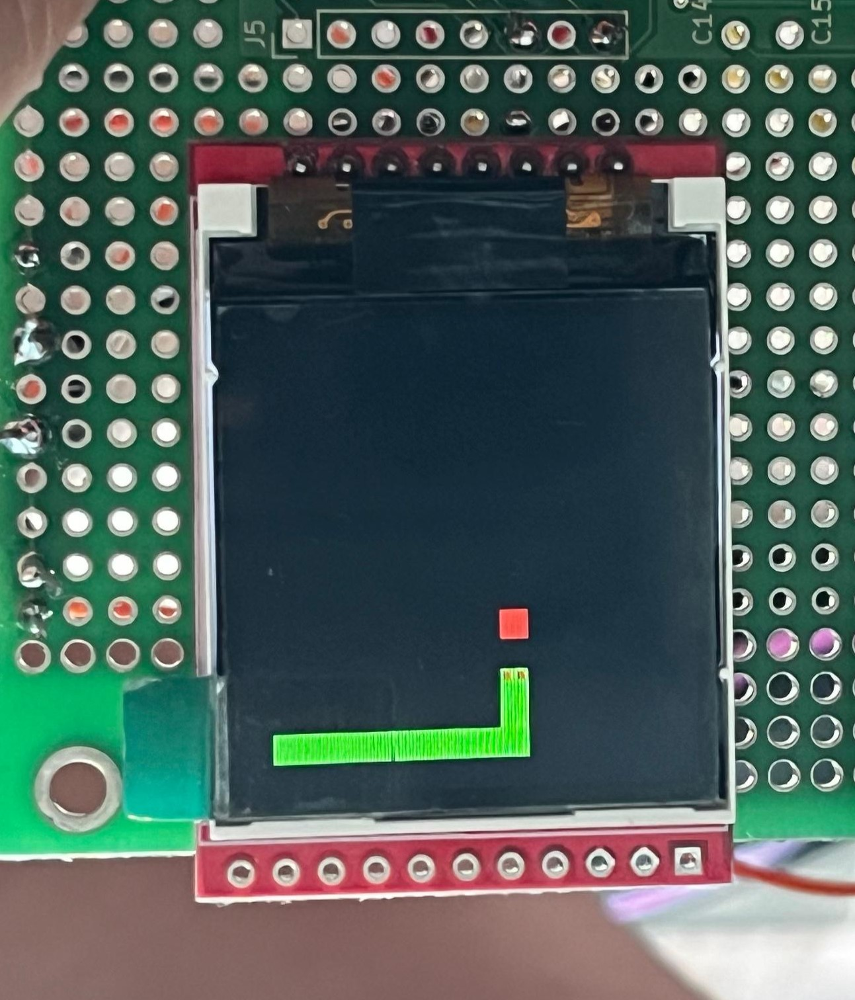

**Game over screen with score:**

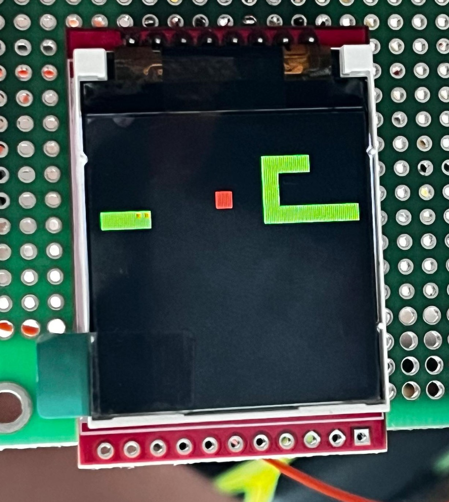

**Speed selection screen:**

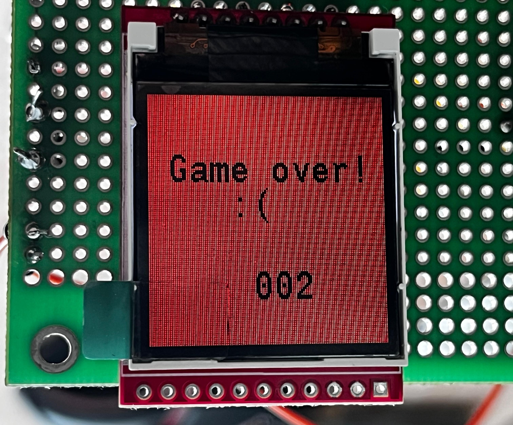

---

## Project Structure

```
.
├── Core/
│   ├── Src/
│   │   ├── main.c          # Main application: Snake logic, interrupts, peripherals
│   │   ├── st7735.c        # Graphics dependecies
        |__ GFX_FUNCTIONS.c
        |__ fonts.c
│   │   └── ...
│   └── Inc/
│       ├── main.h
│       └── st7735.h
|       |__ ... 
├── Drivers/
│   ├── ...
└── README.md
```

---

## Build & Flash

This project was built using **STM32CubeIDE** with the STM32 HAL library.

1. Clone the repository and open the `.ioc` project file in STM32CubeIDE.
2. Build the project (`Ctrl+B`).
3. Flash to the board via ST-Link (`Run → Debug` or `Run → Run`).
4. Connect a serial terminal at **9600 baud** to USART1 (PA9/PA10) for debug output.

**Target device:** STM32F103CBTx  
**Toolchain:** GNU Arm Embedded Toolchain (arm-none-eabi-gcc)  
**IDE:** STM32CubeIDE 1.x  

---

## Authors

Developed as a university project at **UNSTPB ETTI — Faculty of Electronics, Telecommunications and Information Technology**, Bucharest, Romania.  
Academic year: **2024**  
Course: **Project 2 (P2)**

---

*Built from scratch, soldered by hand, debugged with patience.* 🐍
